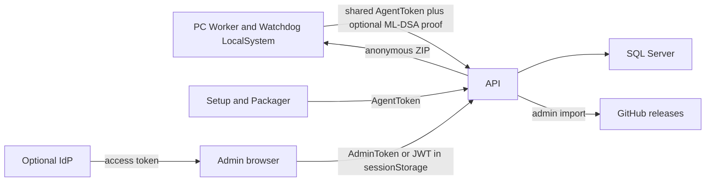

# sw-license-watcher 보안심의 결과

- 심사일: 2026-10-07
- 대상: 이 저장소의 현재 구현과 [company-deployment.md](company-deployment.md)의 회사 배포 모델
- 방법: 소스와 기존 테스트의 정적 검토. 라이브 서버 침투와 비밀 추출은 하지 않았다.
- 제품 코드는 수정하지 않았다.

## 요약 판정

회사 PC 전역에 그대로 배포하기에는 **부적절**하다. 인증 역할 분리, SQL 값 처리, 업데이트 패키지 검증의 골격은 맞다. 다만 기기 증명이 수집 경로에서 강제되지 않고, 서버 비밀과 CA 개인키가 설치 디렉터리의 기본 권한으로 남는다. 이 두 항목을 고치기 전에는 라이선스 대장과 관리자 권한이 공유 에이전트 토큰, 또는 API 서버에 로그온할 수 있는 로컬 사용자에게 열린다.

| 구분 | 건수 |
| --- | --- |
| 결함 | 4 (높음 2, 중간 1, 낮음 1) |
| 설계 의도 | 아래 「설계 의도」. 권고 대상 아님 |
| 적절한 통제 | 아래 「적절한 통제」 |

높음 1, 중간 1, 낮음 1의 GHSA 초안은 [advisories/](advisories/)에 있다. 공개 권고로 제출하지 않았다.

공유 에이전트 토큰, `/admin` 정적 파일의 무인증, Worker ZIP의 무인증 다운로드, LocalSystem 서비스는 배포 문서에 있는 전제다. 그 전제만으로 결함으로 보지 않았다. 전제를 다른 통제가 실제로 막는지로 판정했다.

## 신뢰 경계

의도된 구분은 다음과 같다.

- 에이전트 토큰: 스냅샷, 하트비트, 제거 요청 조회, 사용자 메시지 수신, 매니페스트 조회
- 관리자 토큰 또는 JWT: 조회, 정책, 스키마, 제거 승인, 업데이트 핀, GitHub 가져오기
- 기기 고유값: 서버 CA가 발급하는 ML-DSA-87 인증서와 그 개인키 증명
- 익명: `/health`, `/admin` 정적 파일, `GET /api/updates/worker/package/{version}`

Worker는 개인키가 있으면 수집 요청에 증명을 넣는다. 서버는 그 증명이 비어 있어도 수집을 받는다. 이 차이가 아래 높음 결함이다.

## 결함

### 높음 1. 수집과 하트비트는 기기 증명 없이 통과한다

판정: 결함. 심각도: 높음.

근거:

- [DeviceEnrollmentService.TryAccept](../src/SwLicenseWatcher.Api/DeviceEnrollmentService.cs)는 증명이 비어 있으면 바로 성공한다.
- [InventoryIngestionEndpoints](../src/SwLicenseWatcher.Api/InventoryIngestionEndpoints.cs)는 그 결과만 보고 스냅샷과 하트비트를 저장한 뒤, 해당 기기 코드의 제거 명령과 사용자 메시지를 응답에 담는다.
- 증명이 있어도 서명은 요청에 실린 공개키에 대해서만 확인한다. 그 기기에 이미 저장된 공개키와 비교하지 않는다.
- 최초 등록은 `DeviceId`가 비어 있을 때 요청의 공개키를 묶는다. SQL 조건은 `DeviceId IS NULL`이라 먼저 도착한 키가 남는다.
- 인플레이스 업그레이드만 증명을 필수로 한다. 테스트 `AuthorizeUpgrade_requires_a_device_proof`.
- 빈 증명을 거절하는 수집 테스트는 없다.

영향:

공유 `AgentToken`을 가진 호출자는 기기 코드를 지정해 다른 PC의 설치 소프트웨어 대장을 덮어쓴다. 블랙리스트 적발과 신규 소프트웨어 알림이 그 대장을 따른다. 같은 응답으로 그 PC에 대기 중인 사용자 메시지와, 관리자가 지시한 제거 코드가 돌아온다. 코드를 먼저 소비하면 대상 PC의 원격 제거는 끝나지 않는다. 아직 키가 없는 기기에는 호출자의 공개키가 먼저 묶여, 이후 업그레이드 승인은 그 키의 증명만 통과한다.

제거 명령은 그 응답을 받은 쪽의 Worker가 자기 PC에서 실행한다. 다른 PC를 호출자가 직접 지우게 되지는 않는다. 피해는 대장 위조, 메시지 열람, 제거 승인 무력화, 최초 키 선점이다.

현실적인 경로: 직원 PC의 `appsettings.json`은 기본 설치 경로 `C:\Program Files\SwLicenseWatcher`에 있고, 이 디렉터리의 기본 ACL은 Users 읽기를 포함한다. [Install-Agent.ps1](../deploy/scripts/Install-Agent.ps1)은 이 파일의 ACL을 좁히지 않는다. 로그온한 사용자는 자기 PC의 에이전트 토큰을 읽을 수 있고, 그 토큰은 전 PC가 같다. 회사 Setup.exe에도 같은 토큰이 들어 있다.

고치기 전 운영 조건: 전 PC 배포를 보류한다. 수집·하트비트·SSE·제거 조회·메시지 소비는 그 기기에 등록된 개인키의 증명이 있을 때만 통과해야 한다. 이미 등록된 기기에는 요청 키가 저장된 키와 같아야 한다.

### 높음 2. API 비밀과 CA 개인키가 설치 디렉터리 기본 권한으로 남는다

판정: 결함. 심각도: 높음.

근거:

- [Install-ApiServer.ps1](../deploy/scripts/Install-ApiServer.ps1)의 기본 설치 경로는 `C:\Program Files\SwLicenseWatcher`이고, `appsettings.json`에 `AgentToken`, `AdminToken`, SQL 연결 문자열을 쓴다. ACL을 바꾸지 않는다.
- GitHub PAT와 SMTP 비밀번호도 같은 파일의 설정이다.
- [FileDeviceCertificateAuthority](../src/SwLicenseWatcher.Crypto/FileDeviceCertificateAuthority.cs)는 CA 개인키를 JSON 평문으로 콘텐츠 루트에 만든다. DPAPI도 ACL도 없다. 기본 파일명은 `device-ca.mldsa87.json`.
- 에이전트 개인키는 [LocalIdentityFileAcl.RestrictPrivateKey](../src/SwLicenseWatcher.Agent.Worker/LocalIdentityFileAcl.cs)로 SYSTEM과 Administrators만 두려고 한다. 서버 CA 키에는 같은 처리가 없다.

Windows의 `C:\Program Files` 기본 ACL은 Users에게 읽기를 준다. API 서버에 로그온할 수 있는 로컬 사용자, 또는 Users로 읽는 다른 서비스 계정은 관리자 토큰, SQL 비밀번호, CA 개인키를 읽을 수 있다. CA 개인키로는 기기 인증서를 발급할 수 있다. 관리자 토큰으로는 정책, 스키마 변경, 제거 승인, 업데이트 핀 변경이 된다.

고치기 전 운영 조건: API 서버는 관리자만 로그온하는 전용 호스트로 두고, 설치 디렉터리와 CA 키 파일을 SYSTEM과 Administrators만 읽게 잠근다. 연결 문자열, 두 토큰, GitHub PAT, SMTP 비밀번호는 그 파일 밖으로 빼거나 같은 ACL을 적용한다.

### 중간 1. JWT를 켜고 scope와 role을 비우면 audience만 맞는 토큰이 관리자이다

판정: 결함. 심각도: 중간.

근거:

- [JwtAccessTokenAuthenticator.HasRequiredScope / HasRequiredRole](../src/SwLicenseWatcher.Api/JwtAccessTokenAuthenticator.cs)은 설정이 비어 있으면 통과한다.
- [ApiSecurityOptionsValidator.HasValidJwt](../src/SwLicenseWatcher.Core/Configuration.cs)는 Authority와 Audience만 본다. scope와 role은 필수 조건이 아니다.
- 테스트 `Valid_token_is_accepted_as_admin`은 scope 클레임 없는 토큰을 관리자로 받는다. `Missing_required_scope_is_rejected`와 `Missing_required_role_is_rejected`는 값을 넣었을 때만 거절한다.
- 같은 검증기는 Authority와 MetadataAddress에 HTTP를 허용한다. 메타데이터 조회는 그 주소가 `https://`일 때만 HTTPS를 요구한다.

영향:

`Security:Jwt:Authority`만 채우고 `RequiredScope`와 `RequiredRole`을 비우면, 그 audience로 발급된 액세스 토큰은 관리자 API 전체가 된다. 테넌트 사용자가 그 audience의 토큰을 받을 수 있으면 정책 변경, 제거 지시, 업데이트 핀 변경까지 포함한다. HTTP 메타데이터 주소는 서명키 조회가 변조될 수 있다.

배포 문서는 scope를 권고하고, 코드는 비어 있는 설정을 기동 때 거절하지 않는다. JWT는 기본값이 꺼져 있어 정적 토큰만 쓰는 구성에는 바로 열리지 않는다.

고치기 전 운영 조건: JWT를 켤 때는 `RequiredScope` 또는 `RequiredRole` 중 하나를 반드시 넣고, Authority와 MetadataAddress는 HTTPS만 쓴다. 둘 다 비운 채 JWT를 켜지 않는다.

### 낮음 1. 기기 개인키 ACL 적용 실패를 무시한다

판정: 결함. 심각도: 낮음.

근거: [LocalIdentityFileAcl.Apply](../src/SwLicenseWatcher.Agent.Worker/LocalIdentityFileAcl.cs)는 `SetFileSecurity`의 성공 여부를 보지 않는다. 실패하면 파일은 디렉터리에서 물려받은 ACL로 남는다. 개인키 파일은 DPAPI `LocalMachine`으로 암호화되어 있고, 이 범위는 암호문을 읽을 수 있는 같은 PC의 사용자가 복호화할 수 있다. ACL이 적용된 뒤에는 SYSTEM과 Administrators만 읽는다.

영향: ACL 적용이 실패한 PC에서는 로그온 사용자가 기기 개인키를 복호화할 수 있다. 그 키로 높음 1의 증명을 만들 수 있다. 적용이 성공하면 이 경로는 로컬 관리자로 한정된다.

고치기 전 운영 조건: 설치 후 개인키 파일 ACL이 SYSTEM과 Administrators뿐인지 확인한다. 코드는 적용 실패를 서비스 시작 실패로 다루는 편이 맞다.

## 설계 의도

아래는 결함이 아니다. 공유 에이전트 토큰, 익명 Worker ZIP, GitHub 가져오기 때의 서명 요구, 웹훅 주소, GitHub 자산 주소, 제거 코드의 보관, 로컬 큐의 DPAPI는 이 제품의 설계이다. GHSA에 넣지 않는다.

### 공유 에이전트 토큰과 설치 파일

전 PC와 회사 Setup.exe가 같은 `AgentToken`을 가진다. 높음 1을 고친 뒤에도 이 토큰으로 새 기기 행을 만들고, 업데이트 매니페스트를 읽고, 자기 증명이 있는 요청을 보낼 수 있다. 다른 PC의 등록 키를 대신 증명하지는 못한다.

### 익명 Worker ZIP

`GET /api/updates/worker/package/{version}`은 인증이 없다. 테스트 `IsAnonymous_allows_health_admin_assets_and_worker_package_downloads`. 0.1.x 클라이언트가 이 주소로 파일을 받게 한 전제다. ZIP은 에이전트 바이너리이며 토큰은 들어 있지 않다. 설치 무결성은 인증이 필요한 매니페스트의 SHA-256과, 켜져 있을 때의 Authenticode가 맡는다.

버전을 아는 내부 사용자는 바이너리를 받을 수 있다.

### GitHub 가져오기가 서명 요구를 끈다

[GitHubWorkerUpdateImporter](../src/SwLicenseWatcher.Api/GitHubWorkerUpdateImporter.cs)는 핀을 저장할 때 `RequireAuthenticode`를 false로 둔다. 배포 문서와 같다. 그 상태의 Watchdog는 SHA-256만 맞고 HTTPS인 ZIP을 LocalSystem으로 Worker 자리에 넣는다. 같은 릴리스의 `SHA256SUMS.txt`와 ZIP을 함께 바꿀 수 있는 저장소 권한이 있으면 서명 없이 교체된다.

가져온 핀의 서명 요구가 꺼지는 것은 문서화된 동작이다. 서명이 필요하면 핀을 저장한 뒤 켠다.

### 웹훅 주소

웹훅 URL은 요청이 아니라 서버 설정이다. 절대 HTTP 또는 HTTPS인지만 검사한다. 잘못된 설정이면 API 프로세스가 그 주소로 알림 본문(PC, 소프트웨어 이름)을 POST한다. 내부 주소와 링크로컬을 따로 막지는 않는다.

운영자는 받을 웹훅 주소를 설정으로 지정한다.

### GitHub 자산 다운로드 주소

자산 URL은 GitHub 응답의 절대 주소이고, 호스트 허용 목록은 없다. 가져오기는 관리자 토큰이 필요하다. 수신 JSON의 주소가 GitHub가 아니면 API 서버가 그 주소로 GET한다. 같은 HttpClient에 PAT가 기본 인증 헤더로 붙어 있다.

가져오기는 관리자 토큰이 필요하고, 자산 주소는 GitHub 응답을 따른다.

### 제거 코드의 평문 보관

승인 코드는 15분, 관리자 지시 코드는 7일 동안 SQL `CodeColumn`에 평문으로 있다. 소비되거나 취소되면 컬럼은 NULL이 된다. 대시보드 목록은 코드를 반환하지 않는다. 해시와 상수시간 비교는 있다. 알파벳 길이 32와 바이트 나머지 연산은 맞물려 편향이 없다. 길이는 8자라 네트워크로 전수 시도하기에는 크다. 레이트 리밋은 없다.

에이전트가 코드를 다시 읽을 수 있게 평문으로 둔다. 높음 1이 남아 있으면 이 코드는 공유 에이전트 토큰으로도 읽을 수 있으며, 그 경로는 높음 1 결함에 속한다.

### 로컬 큐의 DPAPI

스냅샷 큐는 DPAPI `LocalMachine`과 인스턴스 이름을 엔트로피로 쓴다. 설치 스크립트는 `C:\ProgramData\SwLicenseWatcher`의 ACL을 좁히지 않는다. 암호문을 읽을 수 있는 같은 PC 사용자는 대기 중인 설치 소프트웨어 목록을 복호화할 수 있다. 개인키 파일은 별도 ACL을 시도한다.

로컬 관리자가 기기 개인키를 읽는 것은 LocalSystem 서비스 모델의 범위이다. ACL 적용 실패를 무시하는 것은 낮음 1 결함이다.

### 의존성 자동 머지와 서명 없는 릴리스

Dependabot PR이 CI를 통과하면 main에 스쿼시 머지되고 CD가 도는 것은 의도된 동작이다. 이 저장소는 오픈소스이다. Authenticode는 서명 인증서를 가진 배포자가 선택하는 옵션이고, 시크릿이 없어 바이너리가 서명되지 않는 것은 결함이 아니다. 서명이 필요하면 받는 쪽 또는 배포자가 자체 인증서로 서명한다. 둘 다 권고 대상이 아니다.

## 적절한 통제

아래는 코드와 기존 테스트로 막혀 있다.

### 인증과 권한

- 에이전트 토큰과 관리자 토큰은 각각 32자 이상이고 서로 달라야 기동한다. 레거시 단일 `Security:Token`은 거절한다. 테스트 `ApiSecurityOptionsValidatorTests`, `IsAuthorized_legacy_token_is_not_accepted`.
- 비교는 헤더 전체의 SHA-256을 `FixedTimeEquals`로 본다.
- 에이전트 토큰은 수집, 하트비트, 에이전트용 제거·메시지·업그레이드, 매니페스트 GET에만 통한다. 정책, 스키마, 제거 승인, 매니페스트 PUT, GitHub 가져오기에는 통하지 않는다. 테스트 `BearerTokenAuthenticatorTests`, `IsAuthorized_only_admin_can_import_github_releases`, `IsAgentEndpoint_treats_manifest_put_as_admin_only`.
- JWT는 관리자 엔드포인트에서만 보고, 수집 경로로는 열리지 않는다. 발급자, audience, 수명, 서명키를 검사한다. scope 또는 role을 설정하면 그 값이 없으면 거절한다.
- 원격 HTTP는 `RequireHttps` 기본값에서 거절한다. `X-Forwarded-Proto`를 신뢰하지 않아 헤더로 HTTPS를 가장할 수 없다. 루프백 HTTP만 허용한다. IIS in-process는 사이트 바인딩의 HTTPS를 따른다.
- 익명 경로는 `/health`, `/admin` 아래 정적 파일, Worker 패키지 접두사뿐이다. 비슷한 경로(`/adminfoo`, `/healthz`, `/api/updates/worker/packages/...`)는 익명이 아니다. 테스트 `PublicPathsTests`.
- `/health` 실패 문구는 `Database is unavailable.`이다. 처리되지 않은 예외 응답은 `An unexpected error occurred.`이다.
- 스냅샷 본문은 8 MiB, 하트비트 본문은 64 KiB로 제한한다. 테스트 `EndpointPoliciesTests`.
- `/admin` 응답에는 CSP, `nosniff`, `no-referrer`, `no-store`가 있다. CSP에 `unsafe-inline`은 없다. 관리자 토큰은 `sessionStorage`에만 둔다. API는 `Authorization` 헤더라 쿠키 CSRF 대상이 아니다.

### 데이터

- SQL 식별자는 영문, 숫자, 밑줄과 길이 128로 제한한 뒤 괄호로 감싼다. 값은 파라미터다. `LIKE` 검색의 `%`, `_`, `[`는 이스케이프한다.
- `POST /api/schema/sql`은 호출자가 넘긴 SQL을 실행하지 않는다. 서버가 만든 DDL을 관리자 토큰으로 적용한다.
- `/api/design`은 연결 문자열이 있는지만 반환하고 값 자체는 반환하지 않는다.
- 저장소의 `appsettings`와 `deploy/examples` 토큰은 빈 값 또는 `REPLACE_ME` 자리표시자이다.

### 업데이트와 제거의 나머지 통제

- 패키지 URL은 절대 HTTPS이거나 루프백 HTTP만 허용한다.
- Watchdog는 서버 호스트, 스킴, 포트가 같을 때만 에이전트 토큰을 붙인다. 다른 호스트로 토큰이 나가지 않는다.
- ZIP 항목은 대상 디렉터리 접두사 밖으로 풀리지 않고, 압축 해제 크기 한도가 있다. 패키지 버전 문자열은 경로 문자와 `..`를 거절한다.
- SHA-256이 맞은 뒤에, 핀이 요구하면 EXE와 DLL에 `WinVerifyTrust`를 수행한다. 헬스 실패 시 이전 Worker 디렉터리로 되돌린다.
- 업그레이드 스테이지, 백업, 설치 디렉터리가 서로 포함 관계이면 Watchdog 설정 검증이 실패한다.
- 사용자 Toast는 기기 개인키 서명이 있고 유효 시간 안일 때만 표시한다. 헬퍼는 로그온 사용자 토큰으로 실행되며 LocalSystem으로 사용자 세션에서 돌지 않는다. 테스트 `UserToastAccessTests`.
- SMTP는 핀이 있으면 그 지문으로 받고, 핀이 없으면 체인 오류가 없는 인증서만 받는다. 테스트 `SmtpCertificatePinningTests`.
- ML-DSA-87 발급과 검증, 증명 페이로드가 기기 코드와 묶이는지는 테스트 `MldsaDeviceCryptoTests`가 본다. 이 검증이 수집 경로에 연결되어 있지 않은 것이 높음 1이다.

## 배포 전에 지킬 조건

결함으로 남긴 항목만 해당한다. 설계 의도 절의 항목은 배포 조건이 아니다.

1. 등록된 기기의 수집, 하트비트, 이벤트 스트림, 제거 코드 조회, 메시지 소비는 저장된 개인키의 증명이 있을 때만 허용한다.
2. API 설치 디렉터리, `appsettings.json`, CA 키 파일은 SYSTEM과 Administrators만 읽게 한다.
3. JWT를 쓰면 scope 또는 role을 넣고, 메타데이터 주소는 HTTPS만 쓴다.
4. 기기 개인키 ACL 적용이 실패하면 그 키로 동작하지 않게 한다.

## 근거로 본 테스트

- `BearerTokenAuthenticatorTests`
- `PublicPathsTests`
- `EndpointPoliciesTests`
- `ApiSecurityOptionsValidatorTests`
- `JwtAccessTokenAuthenticatorTests`
- `DeviceEnrollmentServiceTests`
- `MldsaDeviceCryptoTests`
- `SmtpCertificatePinningTests`
- `UserToastAccessTests`

테스트가 없다는 이유만으로 결함으로 보지 않았다. 높음 1은 수집 경로가 빈 증명을 성공으로 처리하는 구현이고, 그 성공을 거절하는 테스트는 없다.
